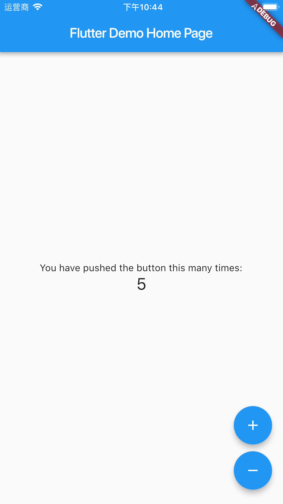

# BLOC重构Counter实现

**说明：** 本部分完成部分在分支： <https://github.com/dragonetail/flutterpoc/tree/counter_refactor>

**目标：** 根据Flutter缺省计数器例子，遵循Bloc的理念实现增减计数器的逻辑和视图分离。


1. 使用fluter命令创建APP，然后在pubspec.yaml中追加依赖

   ```yaml
     cupertino_icons: ^0.1.2
     flutter_bloc: ^0.9.1
     meta: ">=1.1.6 <2.0.0"
     equatable: ^0.2.0
   ```

2. 环境准备，使用vscode，安装bloc的插件辅助代码生成。
   参考： https://felangel.github.io/bloc/#/blocvscodeextension>
   直接用这个链接安装： https://marketplace.visualstudio.com/items?itemName=FelixAngelov.bloc

3. 创建目录结构：

   ```dart
   lib
     blocs  #BLOC逻辑代码
     pages  #页面代码
     widgets  #组件代码
   ```

4. 在blocs目录下面上右键菜单【Bloc： new bloc】（第二部插件提供功能），输入bloc名字为counter，将创建如下：

   ```
   blocs
     bloc  # 需要手工更改为counter
       bloc.dart               
       counter_bloc.dart       
       counter_event.dart      
       counter_state.dart
   ```

   更改生成的bloc目录为counter

5. 在blocs下面创建blocs.dart和simple_bloc_delegate.dart，结果文件列表：

   ```
   blocs
     counter  
       bloc.dart               
       counter_bloc.dart       
       counter_event.dart      
       counter_state.dart
     blocs.dart
     simple_bloc_delegate.dart
   ```

6. counter目录下面生成的文件内容和修改结果：

   - 首先是package的索引，bloc.dart，是当前目录下面内容的export索引文件。内容：

   ```dart
   export 'counter_bloc.dart';
   export 'counter_event.dart';
   export 'counter_state.dart';
   ```

   - 事件counter_event.dart文件，为计数器业务逻辑的事物定义。根据Bloc官网资料<https://felangel.github.io/bloc/#/fluttercountertutorial>的做法看，可以简单使用Enum来实现Event定义，使用int实现state的处理。作为工程化探讨，这里使用标准的Bloc做法进行处理。

     ```dart
     import 'package:equatable/equatable.dart';
     import 'package:meta/meta.dart';
     
     @immutable
     abstract class CounterEvent extends Equatable {
       CounterEvent([List props = const []]) : super(props);
     }
     
     class IncrementEvent extends CounterEvent {
       IncrementEvent() : super();
     
       @override
       String toString() => 'IncrementEvent';
     }
     
     class DecrementEvent extends CounterEvent {
       DecrementEvent() : super();
     
       @override
       String toString() => 'DecrementEvent ';
     }
     ```

     这个地方使用了增强Equatable组件，Bloc官网没有说明，应该属于增强组件相等性判断的实现，暂不追究原理。

     根据Bloc的模板，首先实现了一个抽象类，这个抽象类声明了【@immutable】，则其所有子类都不可变更，即不能有可变的成员变量（表达某种特定事件实例的含义）。

     上面例子，通过实例化实现了两个Event类型，IncrementEvent和DecrementEvent。

     【最佳实践】查看了Bloc的其他示例，这个地方规约没有统一化，建议所有的Event实例类都以Event结尾。

   - 计数器状态控制counter_state.dart：

     ```dart
     import 'package:equatable/equatable.dart';
     import 'package:meta/meta.dart';
     
     @immutable
     abstract class CounterState extends Equatable {
       CounterState([List props = const []]) : super(props);
     }
     
     class CountingState extends CounterState {
       final int counter;
     
       CountingState(this.counter) : super([counter]);
     
       @override
       String toString() {
         return 'CountingState { counter: $counter }';
       }
     }
     ```

     同Event，state的实现也基本一样，通过【@immutable】约束了所有State类为不可变（表达某种特定状态实例的含义）。

     上面例子，实例化实现了一个状态CountingState，表达了技术过程中的某一时刻的状态，其有一个成员变量counter表示计数器的状态，通过构造函数初始化，不可改变。

     【最佳实践】所有状态实例类以State结尾。

     【其他】同Swift语言一样，Dart语言也依赖变量直接暴露出来进行数据交互，不使用setter和getter方法。

   - 业务逻辑counter_bloc.dart实现：

     ```dart
     import 'dart:async';
     import 'package:bloc/bloc.dart';
     import './bloc.dart';
     
     class CounterBloc extends Bloc<CounterEvent, CounterState> {
       @override
       CounterState get initialState => CountingState(0);
     
       @override
       Stream<CounterState> mapEventToState(
         CounterEvent event,
       ) async* {
         if (event is IncrementEvent) {
           yield* _mapIncrementEventToState();
         } else if (event is DecrementEvent) {
           yield* _mapDecrementEventState(event);
         }
       }
     
       Stream<CountingState> _mapIncrementEventToState() async* {
         yield CountingState((currentState as CountingState).counter + 1);
       }
     
       Stream<CountingState> _mapDecrementEventState(DecrementEvent event) async* {
         yield CountingState((currentState as CountingState).counter - 1);
       }
     }
     ```

     首先需要通过重载实现initialState的实现，Bloc框架会实现当前bloc的状态，通过变量currentState访问。

     业务逻辑主要放到mapEventToState进行处理，根据Bloc的实践例子，这个地方主要是通过event类型进行判断，调用不同的本地私有map函数进行分类处理。

     mapEventToState的返回类型是`Stream<State>`类型，表达状态流。

7. blocs下面blocs.dart和simple_bloc_delegate.dart：

   - blocs.dart是export索引。

   - simple_bloc_delegate.dart是根据官网示例对Bloc的默认delegate进行扩展，追加Debug日志功能：

     ```dart
     import 'package:bloc/bloc.dart';
     
     class SimpleBlocDelegate extends BlocDelegate {
       @override
       void onTransition(Transition transition) {
         super.onTransition(transition);
         print(transition);
       }
     
       @override
       void onError(Object error, StackTrace stacktrace) {
         super.onError(error, stacktrace);
         print(error);
       }
     }
     ```

     定义了这个，需要在APP启动时在main.dart中进行设定使用。

     ```dart
     void main() {
       BlocSupervisor().delegate = SimpleBlocDelegate();
     
       runApp(MyApp());
     }
     ```

8. 改写MyHomePage：

   ```dart
   import 'package:flutter/material.dart';
   import 'package:flutter_bloc/flutter_bloc.dart';
   import 'package:flutterpoc/pages/pages.dart';
   import 'package:flutterpoc/blocs/blocs.dart';
   
   class MyHomePage extends StatefulWidget {
     MyHomePage({Key key, this.title}) : super(key: key);
   
     final String title;
   
     @override
     _MyHomePageState createState() => _MyHomePageState();
   }
   
   class _MyHomePageState extends State<MyHomePage> {
     final CounterBloc _counterBloc = CounterBloc();
   
     @override
     Widget build(BuildContext context) {
       return Scaffold(
         appBar: AppBar(
           title: Text(widget.title),
         ),
         body: BlocProvider<CounterBloc>(
           bloc: _counterBloc,
           child: CounterPage(),
         ),
       );
     }
   }
   ```

   沿用缺省示例生成的StatefulWidget，并在State中定义了CounterBloc，然后再body处使用BlocProvider把        【bloc: _counterBloc】注入（DI）到Bloc的context中，然后在CounterPage中使用`final CounterBloc _counterBloc = BlocProvider.of<CounterBloc>(context);`可以获取之前注入的bloc变量。

9. 页面CounterPage的实现：

   ```dart
   import 'package:flutter/material.dart';
   import 'package:flutter_bloc/flutter_bloc.dart';
   import 'package:flutterpoc/blocs/blocs.dart';
   import 'package:flutterpoc/widgets/widgets.dart';
   
   class CounterPage extends StatelessWidget {
     @override
     Widget build(BuildContext context) {
       final CounterBloc _counterBloc = BlocProvider.of<CounterBloc>(context);
   
       return Scaffold(
         body: BlocBuilder<CounterEvent, CounterState>(
           bloc: _counterBloc,
           builder: (BuildContext context, CounterState counterState) {
             return Center(
               child: Column(
                 mainAxisAlignment: MainAxisAlignment.center,
                 children: <Widget>[
                   Text(
                     'You have pushed the button this many times:',
                   ),
                   Text(
                     '${(counterState as CountingState).counter}',
                     style: TextStyle(fontSize: 24.0),
                   ),
                 ],
               ),
             );
           },
         ),
         floatingActionButton: Column(
           crossAxisAlignment: CrossAxisAlignment.end,
           mainAxisAlignment: MainAxisAlignment.end,
           children: <Widget>[
             PaddingFloatingActionButton(
               icon: Icons.add,
               onPressed: () => _counterBloc.dispatch(IncrementEvent()),
             ),
             PaddingFloatingActionButton(
               icon: Icons.remove,
               onPressed: () => _counterBloc.dispatch(DecrementEvent()),
             )
           ],
         ),
       );
     }
   }
   ```

   完成了页面布局和内容组合。使用StatelessWidget实现widget构造。通过使用`final CounterBloc _counterBloc = BlocProvider.of<CounterBloc>(context);`获取之前父节点注入的bloc变量。

   通过`body: BlocBuilder<CounterEvent, CounterState>(`构造实际关键bloc业务的UI组件。

   通过`'${(counterState as CountingState).counter}'`访问State的值，更新显示。

   通过通用封装组件PaddingFloatingActionButton实现浮动按钮的可重用组件封装。

   【综合】在PaddingFloatingActionButton的onPressed事件中，调用bloc发射事件`onPressed: () => _counterBloc.dispatch(IncrementEvent()),`。在Bloc的实现中，根据mapEventToState进行事件到State的映射转换，转换成State后，通过`Stream<CounterState>`激活`body: BlocBuilder<CounterEvent, CounterState>(`的重构（重绘）操作，实现Widget的局部更新。

10. 最终更改入口main.dart:

   ```dart
   import 'package:flutter/material.dart';
   import 'package:bloc/bloc.dart';
   import 'package:flutterpoc/blocs/blocs.dart';
   import 'package:flutterpoc/pages/pages.dart';
   
   void main() {
     BlocSupervisor().delegate = SimpleBlocDelegate();
   
     runApp(MyApp());
   }
   
   class MyApp extends StatelessWidget {
     // This widget is the root of your application.
     @override
     Widget build(BuildContext context) {
       return MaterialApp(
         title: 'Flutter Demo',
         theme: ThemeData(
           primarySwatch: Colors.blue,
         ),
         home: MyHomePage(title: 'Flutter Demo Home Page'),
       );
     }
   }
   ```

11. 运行截屏：

    

    


## BLOC参考

参考：

- <https://pub.dartlang.org/packages/bloc>
- <https://pub.dartlang.org/packages/flutter_bloc>
- <https://felangel.github.io/bloc/>
- <https://github.com/felangel/bloc/tree/master/examples/>

